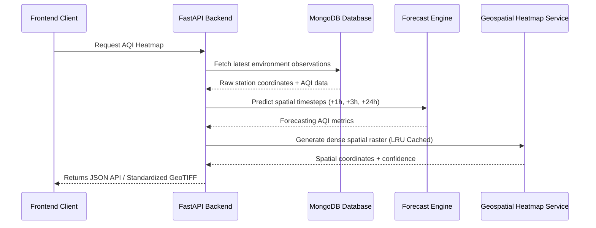

# AQIntel - Urban Air Quality Decision Intelligence Platform

AQIntel is a production-ready, high-performance urban air quality decision intelligence platform designed to ingest multi-source sensor telemetry, run predictive machine learning forecasts, apportion pollution sources, simulate counterfactual interventions, and suggest traffic route diversions.

---

## Architecture Diagram

The pipeline structure flows from multi-source data ingestion to real-time spatial analysis:

```
+------------------+     +------------------+     +--------------------+
|  CPCB / CAAQMS   |     |     OpenAQ       |     | OpenWeather / MERRA|
+--------+---------+     +--------+---------+     +---------+----------+
         |                        |                         |
         +------------------------+-------------------------+
                                  |
                                  ▼
                        +------------------+
                        |   Data Fusion    |
                        +--------+---------+
                                 |
                                 ▼
                        +------------------+
                        |  MongoDB Atlas   |
                        +--------+---------+
                                 |
                                 ▼
                        +------------------+
                        | Forecast Engine  |
                        +--------+---------+
                                 |
                                 ▼
                        +------------------+
                        |  Spatial IDW     |
                        +--------+---------+
                                 |
                                 ▼
                        +------------------+
                        | Confidence Layer |
                        +--------+---------+
                                 |
                                 ▼
                        +------------------+
                        |   Heatmap API    |
                        +--------+---------+
                                 |
                                 ▼
                        +------------------+
                        | Leaflet Frontend |
                        +------------------+
```

---

## Sequence Flow Diagram



---

## Directory Structure

```text
Proj/
├── backend/
│   ├── app/
│   │   ├── api/
│   │   │   └── routes/         # Versioned endpoint routers (map, analysis, system, orchestration)
│   │   ├── coordinator/        # App central orchestration coordinator
│   │   ├── core/               # Configuration settings, logging, database managers
│   │   ├── ml/
│   │   │   ├── forecasting/    # Temporal forecasting ML pipeline
│   │   │   ├── spatial/        # Dense grid generation, spatial caches
│   │   │   └── source_attribution/ # SHAP-backed source apportionment
│   │   ├── scheduler/          # Background cron jobs (data refresh)
│   │   └── services/           # Pluggable IDW interpolator and geospatial service
│   ├── artifacts/              # Pre-trained model weights, stations lookup metadata
│   ├── reports/                # Validation logs, manifest outputs, and benchmark results
│   ├── scratch/                # Verification, benchmark, and system check scripts
│   └── tests/                  # Pytest unit testing suite
├── dataset/
│   └── archive/                # Kaggle-style historical dataset archives
├── docs/
│   └── benchmarks/             # Archived performance JSON and Markdown logs
├── .env                        # Local environment configuration settings
├── .gitignore                  # Git untracked directories mapping
├── requirements.txt            # Package dependencies
└── README.md                   # Technical documentation
```

---

## Version Information

* **App Version**: `1.0.0`
* **API Version**: `v1`
* **Model Version**: `forecasting-lgbm-1.0.0`
* **Data Provider Version**: `openaq-cpcb-1.0.0`
* **Build Date**: `2026-07-21`

---

## Installation

1. **Clone & Setup Directory**:
   Ensure python 3.11 is installed.
   ```bash
   pip install -r requirements.txt
   ```

2. **Database Setup**:
   Ensure MongoDB is running locally on port `27017` or update the MONGODB_URI in `.env`.

---

## Configuration & Environment Variables

Create a `.env` file in the root directory:
```env
ENVIRONMENT=development
LOG_LEVEL=INFO
MONGODB_URI=mongodb://localhost:27017
DATABASE_NAME=aqintel
CITY_NAME=Chennai
ENABLE_GRID_CACHE=True
DEFAULT_LATITUDE=13.0827
DEFAULT_LONGITUDE=80.2707
```

---

## API Reference

### Geospatial Heatmap Endpoints:
- `GET /api/v1/map/intelligence`: Retrieves dense spatial prediction grids.
  - Query parameters: `city`, `horizon` (now, +24h), `layer` (aqi, pm25), `resolution` (low, medium, high), `bbox` (min_lon,min_lat,max_lon,max_lat).
- `GET /api/v1/map/debug`: Retrieves raw intermediate arrays (unmasked grids, raw station layers).

### Decision Intelligence Endpoints:
- `POST /api/v1/analysis/attribution`: Predicts dominant source coordinates via SHAP probabilities.
- `POST /api/v1/analysis/forecast`: Generates hyperlocal forecast values.
- `POST /api/v1/analysis/routes/diversion`: Suggests detour recommendations on congestion.
- `POST /api/v1/orchestration/run`: unified coordinator flow.

---

## Heatmap & Forecast Pipelines

1. **Heatmap Pipeline**:
   - Fetches live data from MongoDB (or fallback pre-seeded stations).
   - Generates an administrative polygon mask from Nominatim boundary caches.
   - Computes spatial coordinates using an **Adaptive Grid Generator** (LRU Cached).
   - Runs vectorized **IDW Spatial Interpolation** with scipy KDTree.
   - Applies normalized boundary-preserving **Gaussian Smoothing**.

2. **Forecast Pipeline**:
   - Implements LightGBM models trained on meteorological parameters to project AQI forward up to 48 hours.

---

## Validation & Performance

### Unit Tests
Execute the complete test suite:
```bash
$env:PYTHONPATH="." ; pytest
```

### Performance Benchmark
Run the performance benchmark to evaluate caching speed-ups:
```bash
$env:PYTHONPATH="." ; python backend/scratch/performance_benchmark.py
```

### Grid Generation & Interpolation Scaling Matrix:

| Resolution | Cells | Cold Run (ms) | Warm Run (ms) | Speed-up | Interpolation (ms) | Memory Delta (MB) |
| :--- | :--- | :--- | :--- | :--- | :--- | :--- |
| 100x100 | 10,000 | 685.46 | 0.47 | 1450.1x | 15.65 | 13.6 |
| 250x250 | 62,500 | 12.94 | 0.45 | 28.9x | 71.38 | 3.75 |
| 500x500 | 250,000 | 44.34 | 0.53 | 83.0x | 305.75 | 13.1 |

---

## Deploy Check

Run the system diagnostics check before deploying or presenting:
```bash
$env:PYTHONPATH="." ; python backend/scratch/system_check.py
```

Outputs:
```text
SYSTEM STATUS:
 [OK]    Environment variables
 [OK]    MongoDB connection
 [OK]    Forecast model
 [OK]    Attribution model
 [OK]    Road graph
 [OK]    Administrative boundary
 [OK]    Cache initialization
 [OK]    100x100 heatmap
 [OK]    GET /health
 [OK]    GET /api/v1/map/intelligence
 [OK]    Disk write permissions
 [OK]    Required directories

==============================
READY FOR DEPLOYMENT
==============================
```

---

## Known Limitations

- **Nominatim API rate limits**: Boundary polygon fetching fallback is subject to OSM Nominatim rate limits. Administrative boundaries are cached to disk to avoid repeat calls.
- **Meteorological fallback**: In the absence of live weather feeds, the forecast engine falls back to pre-seeded climatology defaults.

---

## Future Work

- **Dynamic GPU acceleration**: Vectorize grid contains checks utilizing PyTorch/CUDA tensor wrappers for grids exceeding 1,000x1,000.
- **Air dispersion models**: Upgrade the pluggable IDW module to a full Gaussian Plume dispersion model driven by real-time meteorological wind speed and vector directions.
