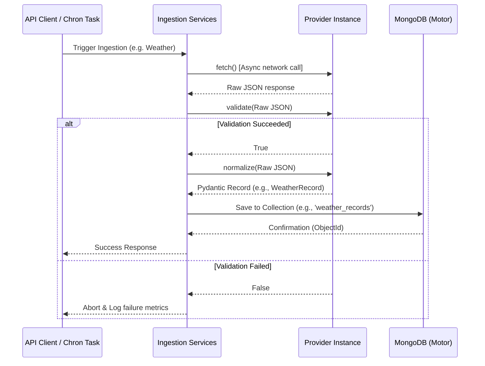

# AQIntel Backend Foundation Architecture

This document describes the structural and technical architecture of the AQIntel (AI-Powered Urban Air Quality Decision Intelligence Platform) backend foundation.

---

## 1. Directory Layout

The directory structure separates API routing, core settings, database configurations, schemas, database models, background services, and future ML prediction models.

```
backend/
├── app/
│   ├── api/                   # Router endpoints group
│   │   ├── attribution.py     # Source apportionment routes
│   │   ├── environment.py     # Live index querying routes
│   │   ├── forecast.py        # Forecasting query routes
│   │   ├── health.py          # Operational health route
│   │   └── recommendation.py  # Decision recommendations routes
│   ├── core/                  # Core application logic
│   │   ├── config.py          # Configuration management via Pydantic Settings
│   │   ├── database.py        # MongoDB connection management client (Async)
│   │   ├── logging.py         # Standardized logger configurations
│   │   └── mongodb.py         # FastAPI dependency injection DB references
│   ├── ml/                    # Machine Learning model files (Placeholder)
│   │   ├── attribution/       # Future source attribution algorithms
│   │   └── forecasting/       # Future LSTM/GNN forecasting models
│   ├── models/                # MongoDB collection document structures
│   │   ├── base.py            # BSON / ObjectId helpers
│   │   └── records.py         # Mongo mapping schemas (AQ, Weather, Fire, GIS, Activity)
│   ├── providers/             # Data integration wrappers (Placeholders)
│   │   ├── base.py            # BaseProvider interface defining fetch/validate/normalize
│   │   ├── caaqms.py          # CAAQMS / CPCB air quality integration
│   │   ├── weather.py         # Meteorological data integration
│   │   ├── gis.py             # Geographical spatial features
│   │   ├── fire.py            # Satellite fire / thermal anomalies
│   │   └── activity.py        # Mobility / heavy vehicle activity indices
│   ├── schemas/               # API payload schemas (Pydantic validation models)
│   │   ├── activity.py
│   │   ├── aq.py
│   │   ├── fire.py
│   │   ├── gis.py
│   │   └── weather.py
│   ├── services/              # Orchestrator services implementing data pipelines
│   │   ├── normalization_service.py
│   │   ├── provider_service.py
│   │   └── validation_service.py
│   ├── utils/                 # Utility math and parsing helpers
│   ├── constants.py           # Global constants (Supported providers, pollutants list)
│   └── main.py                # FastAPI main app initializer
├── docs/                      # Technical documentation
│   └── provider_interface.md  # Detailed specification for writing providers
├── tests/                     # Unit and Integration test suite
│   └── test_health.py         # Endpoint testing checks
├── requirements.txt           # Python application dependencies
└── .env.example               # Environment variables configuration example
```

---

## 2. Central Ingestion Architecture

Ingested data undergoes a uniform pipeline:
1. **Fetch**: The orchestrator triggers the specific Provider's `fetch()` call (HTTP request or simulation output).
2. **Validate**: Validates structural constraints on the raw response payload.
3. **Normalize**: Normalizes units and maps the raw response parameters to a standard Pydantic schema structure.
4. **Save**: Stores the document in its respective collection in MongoDB.

### Data Flow Diagram



---

## 3. Database Layer & Dependency Injection

- **MongoDB client** is initialized asynchronously inside [database.py](file:///c:/Users/Excaliber_AtomiC/Desktop/Hackathons/et%20AI/Proj/backend/app/core/database.py) using the `motor` driver.
- A functional dependency inject helper in [mongodb.py](file:///c:/Users/Excaliber_AtomiC/Desktop/Hackathons/et%20AI/Proj/backend/app/core/mongodb.py) exposes the active database (`get_database()`) or specific collections (`get_collection(name)`) directly to FastAPI routing endpoints, allowing safe, scoped resource locking and test-mockability.

---

## 4. Routing Design

All endpoint groups are prefix-routed under `/api/v1/`:
- `/api/v1/health`: Checks system status and MongoDB response state.
- `/api/v1/environment`: Queries current regional AQIs.
- `/api/v1/forecast`: Fetches predictive forecasting parameters.
- `/api/v1/attribution`: Submits requests for source apportionment.
- `/api/v1/recommendations`: Policy recommendations for urban spaces.

The Swagger specification is dynamically generated and viewable at:
- `/api/v1/docs` (interactive OpenAPI interface)
- `/api/v1/redoc` (detailed static API structure)
